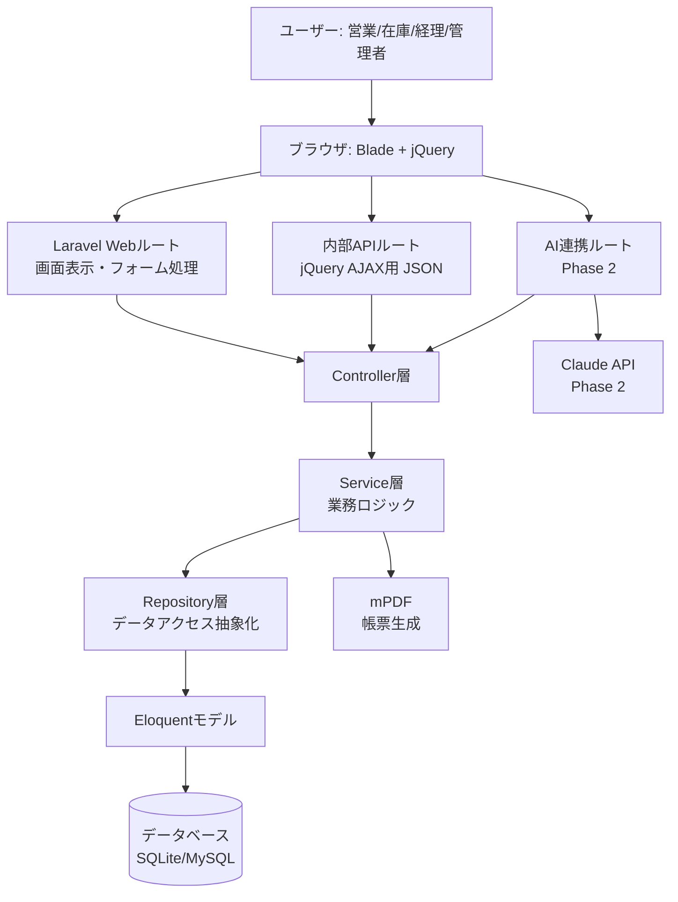

# 製造業向け販売管理システム アーキテクチャ設計

**作成日**: 2026-06-07
**関連要件定義**: [requirements.md](../../spec/manufacture-sales-system/requirements.md)
**ヒアリング記録**: [design-interview.md](design-interview.md)

**【信頼性レベル凡例】**:
- 🔵 **青信号**: 要件定義書・設計ヒアリングを参考にした確実な設計
- 🟡 **黄信号**: 要件定義書・設計ヒアリングから妥当な推測による設計
- 🔴 **赤信号**: 要件定義書・設計ヒアリングにない推測による設計

---

## システム概要 🔵

**信頼性**: 🔵 *要件定義書 概要より*

製造業の販売管理業務（見積→受注→出荷→請求→入金確認）を一元管理するWebシステム。Laravel 13上に構築し、Phase 1でコア業務機能、Phase 2でClaude APIによるAI予測・分析機能を追加する。

## アーキテクチャパターン 🔵

**信頼性**: 🔵 *設計ヒアリングQ4より*

- **パターン**: レイヤードアーキテクチャ + リポジトリパターン
- **構成**: Controller → Service → Repository → Eloquent Model → DB
- **選択理由**:
  - 受注フロー（見積→受注→出荷→請求）は状態遷移と在庫整合性のロジックが複雑になるため、Serviceクラスに業務ロジックを集約する
  - Repositoryでデータアクセスを抽象化し、テスト時にモック化しやすくする
  - Controllerを薄く保ち、可読性・保守性を高める

## コンポーネント構成

### フロントエンド 🔵

**信頼性**: 🔵 *設計ヒアリングQ1より*

- **構成**: Blade テンプレート + jQuery + Vite（アセットビルド）
- **状態管理**: 不要（サーバーサイドレンダリング中心、jQueryでDOM操作・AJAX通信）
- **UIライブラリ**: Bootstrap 5（Breeze標準もしくは別途導入を想定）
- **通信方式**: jQuery.ajax() による内部APIエンドポイント（JSON）への非同期通信（一覧検索・ステータス更新・在庫チェック等）

### バックエンド 🔵

**信頼性**: 🔵 *設計ヒアリングQ3, Q4より*

- **フレームワーク**: Laravel 13.8
- **認証方式**: Laravel Breeze（セッションベース認証）+ Laravel標準のロール・権限制御（Gate/Policy）
- **API設計**: 内部AJAX用エンドポイント（`/api/internal/*`）+ Phase 2用AI連携エンドポイント（`/api/ai/*`）
- **ミドルウェア**: 認証（auth）、役割ベースアクセス制御（role middleware）、CSRF保護（Laravel標準）

### データベース 🔵

**信頼性**: 🔵 *note.md技術スタック・設計ヒアリングQ6より*

- **DBMS**: SQLite（開発）/ MySQL or PostgreSQL（本番、NFR-030）
- **キャッシュ**: Laravel標準のfile/databaseキャッシュ（小規模構成のためRedis等は不要と判断）
- **ORM**: Eloquent ORM（Laravel標準）
- **PDF生成**: mPDF（`mpdf/mpdf`、設計ヒアリングQ2より日本語帳票対応）

## システム構成図



**信頼性**: 🔵 *アーキテクチャパターン・要件定義より*

## ディレクトリ構造 🔵

**信頼性**: 🔵 *Laravel標準構成 + リポジトリパターンより*

```
app/
├── Http/
│   ├── Controllers/
│   │   ├── CustomerController.php
│   │   ├── ProductController.php
│   │   ├── QuotationController.php
│   │   ├── OrderController.php
│   │   ├── ShipmentController.php
│   │   ├── InvoiceController.php
│   │   ├── ReportController.php
│   │   ├── Api/
│   │   │   └── (内部AJAX用コントローラ)
│   │   └── Ai/
│   │       └── (Phase 2: AIチャット・予測コントローラ)
│   └── Middleware/
│       └── EnsureUserHasRole.php
├── Models/
│   ├── User.php
│   ├── Customer.php
│   ├── Product.php
│   ├── Quotation.php / QuotationItem.php
│   ├── SalesOrder.php / SalesOrderItem.php
│   ├── Shipment.php
│   ├── Invoice.php / Payment.php
│   └── StockMovement.php
├── Repositories/
│   ├── Contracts/
│   │   └── (各Repositoryのインターフェース)
│   └── Eloquent/
│       └── (Eloquent実装)
├── Services/
│   ├── QuotationService.php
│   ├── OrderService.php          # 受注確定・在庫引当ロジック
│   ├── ShipmentService.php       # 出荷完了・在庫減算ロジック
│   ├── InvoiceService.php        # 請求書発行・採番ロジック
│   ├── PaymentImportService.php  # 全銀協CSV取込
│   ├── ReportService.php
│   ├── PdfService.php            # mPDFラッパー
│   └── Ai/                       # Phase 2: AI予測・チャット連携
├── Enums/
│   ├── OrderStatus.php
│   ├── PaymentStatus.php
│   └── UserRole.php
└── Providers/

resources/
├── views/
│   ├── customers/, products/, quotations/, orders/,
│   │   shipments/, invoices/, reports/
│   └── pdf/                      # mPDF用テンプレート
└── js/
    └── (jQueryスクリプト群)
```

## 非機能要件の実現方法

### パフォーマンス 🟡

**信頼性**: 🟡 *NFR-001〜003から妥当な推測*

- **レスポンスタイム**: 一覧画面はEager Loading（N+1問題対策）とページネーション（NFR-021）で3秒以内を目標（NFR-001）
- **レポート生成**: 集計はSQLの集約クエリ（GROUP BY）で実施し、必要に応じて結果をキャッシュして10秒以内を達成（NFR-002）
- **同時接続**: 20名規模（NFR-003）であれば標準的なLaravel構成で十分対応可能

### セキュリティ 🔵

**信頼性**: 🔵 *NFR-010〜013・Laravel Breezeより*

- **認証・認可**: Laravel Breeze（セッション認証）+ Gate/Policyによる役割ベースアクセス制御（REQ-002, REQ-003, REQ-064）
- **データ保護**: bcryptパスワードハッシュ化（NFR-010）、CSRF保護（NFR-012）
- **SQLインジェクション対策**: Eloquent ORM使用を徹底（NFR-013）
- **アクセス制御**: ミドルウェアで役割チェックし、権限外アクセスは403を返す（REQ-003）

### スケーラビリティ 🟡

**信頼性**: 🟡 *NFR要件・中小規模想定から妥当な推測*

- 単一サーバー構成を基本とし、必要に応じてDBを別サーバーに分離可能な構成とする
- 水平スケーリングは現時点でスコープ外（同時接続20名規模のため）

### 可用性 🟡

**信頼性**: 🟡 *NFR-031から妥当な推測*

- 日次バックアップ（NFR-031）をLaravelのスケジュールタスクで自動化
- PDF生成失敗時はリトライを促すエラーハンドリング（EDGE-003）

## 技術的制約

### パフォーマンス制約 🔵

**信頼性**: 🔵 *要件定義NFR-001〜003より*

- 一覧画面は1ページ50件のページネーション必須（NFR-021）
- レポート集計クエリは10秒以内に完了すること（NFR-002）

### セキュリティ制約 🔵

**信頼性**: 🔵 *要件定義NFR-010〜013より*

- 全フォームにCSRFトークンを付与
- パスワードはbcryptでハッシュ化、平文保存禁止
- 役割に応じたアクセス制御を全エンドポイントに適用

### 互換性制約 🔵

**信頼性**: 🔵 *note.md技術スタックより*

- PHP 8.3 / Laravel 13.8 を前提とする
- 開発環境はSQLite、本番環境はMySQLまたはPostgreSQL（NFR-030）への切り替えを考慮し、Eloquent標準機能の範囲で実装する（DB固有のSQL文は避ける）

## 関連文書

- **データフロー**: [dataflow.md](dataflow.md)
- **型定義（PHPデータ型）**: [data-types.php](data-types.php)
- **DBスキーマ**: [database-schema.sql](database-schema.sql)
- **API仕様**: [api-endpoints.md](api-endpoints.md)
- **要件定義**: [requirements.md](../../spec/manufacture-sales-system/requirements.md)

## 信頼性レベルサマリー

- 🔵 青信号: 13件（87%）
- 🟡 黄信号: 2件（13%）
- 🔴 赤信号: 0件（0%）

**品質評価**: 高品質
