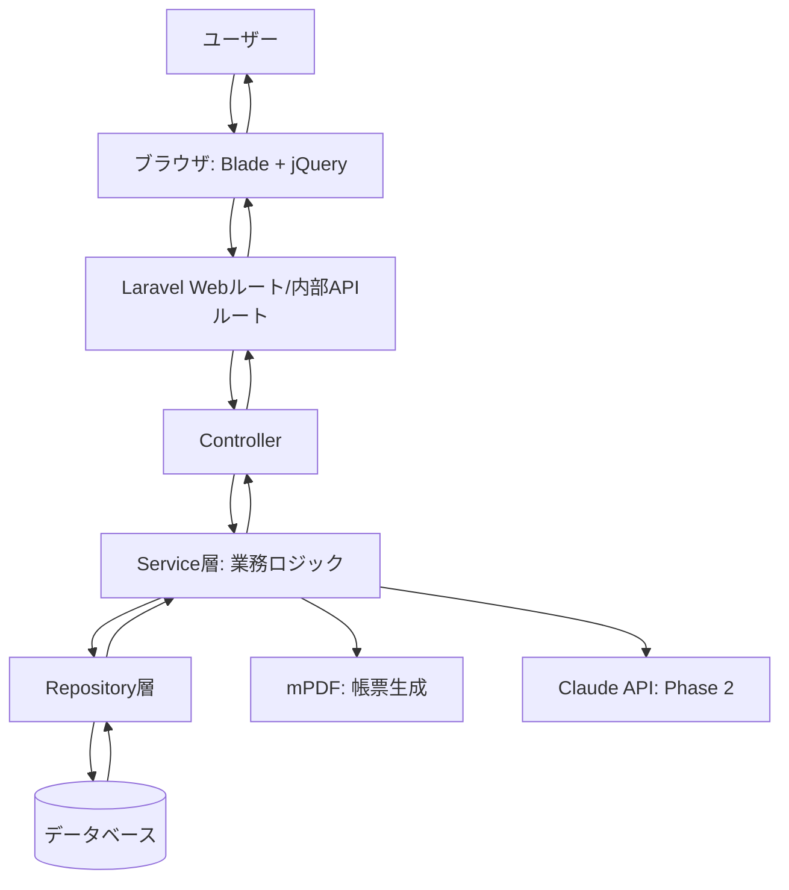
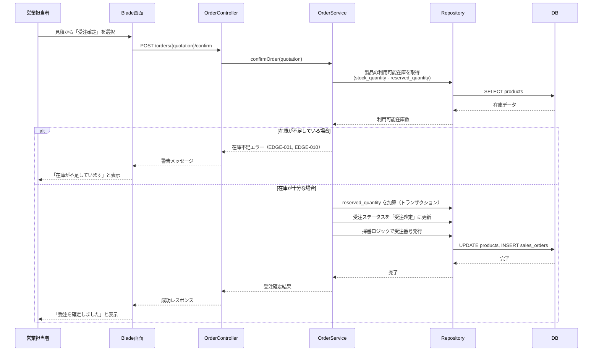
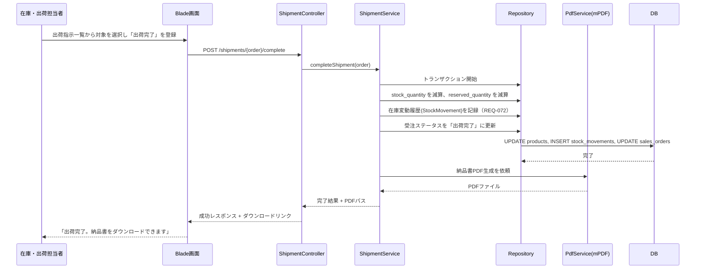
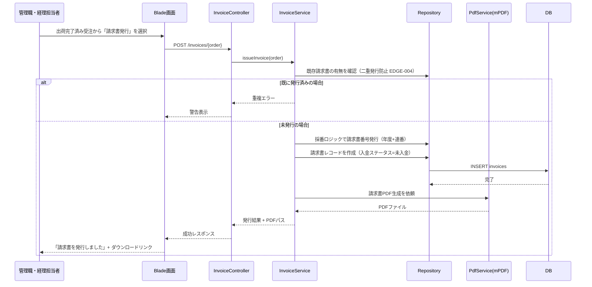
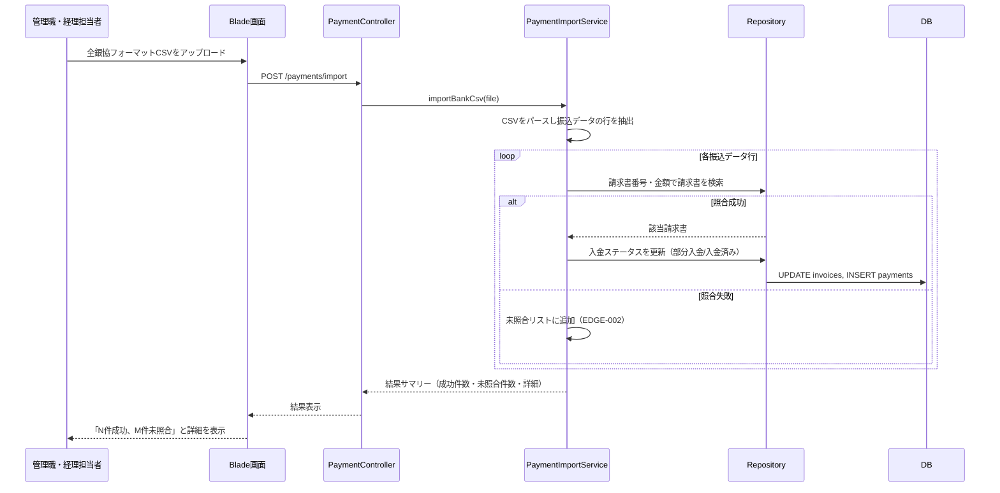
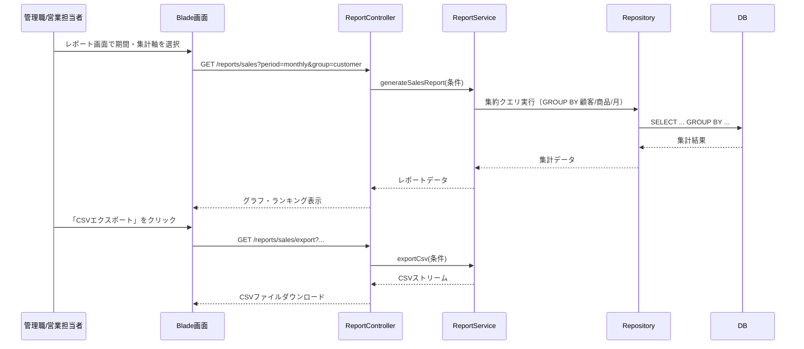
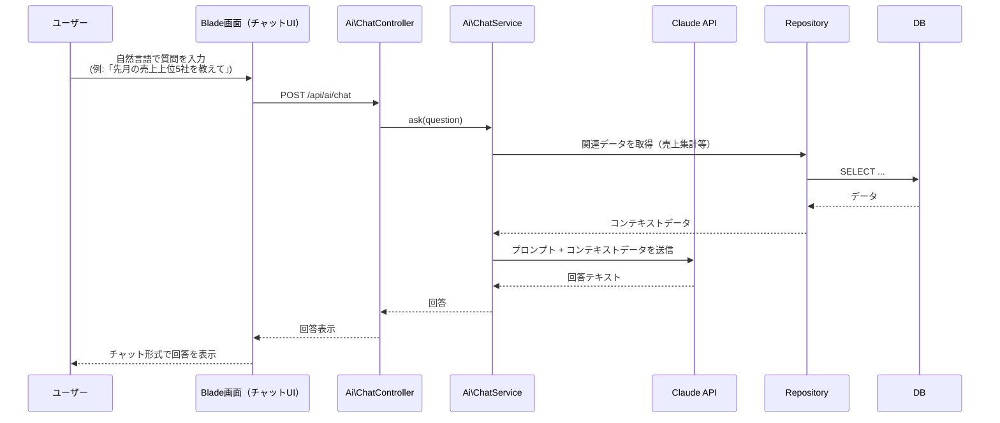
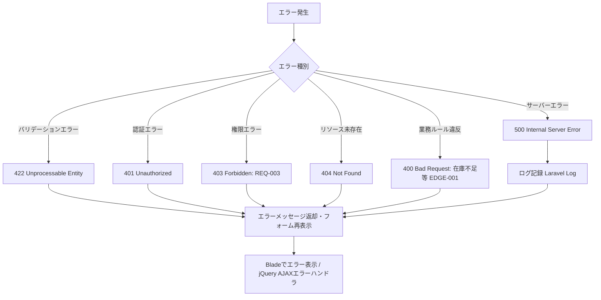
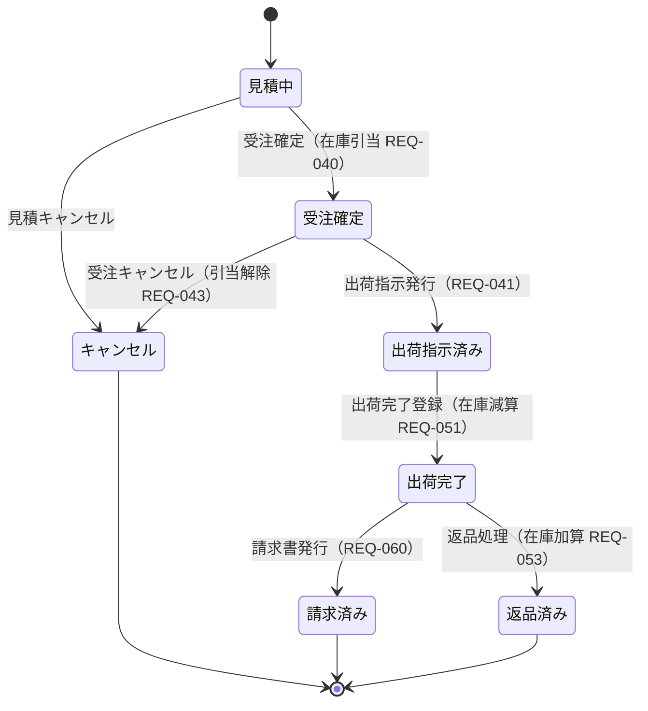
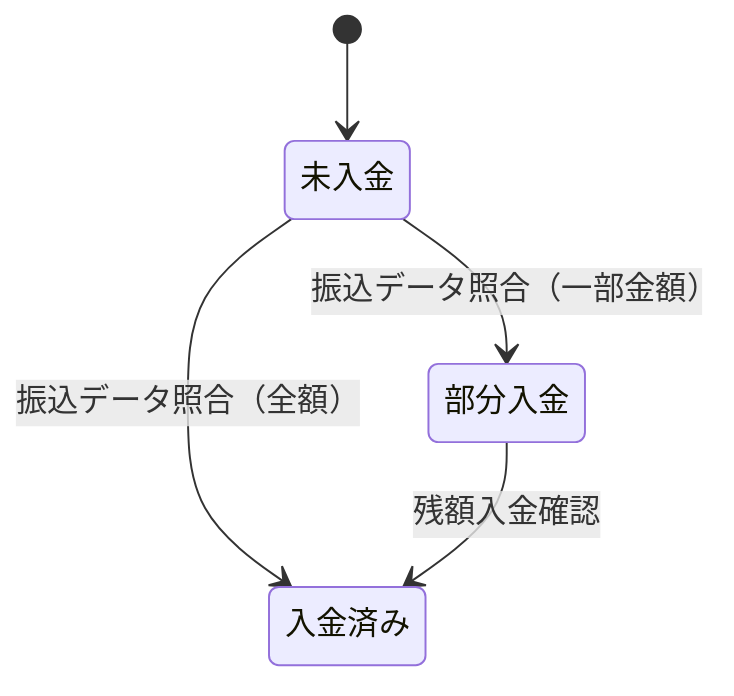

# 製造業向け販売管理システム データフロー図

**作成日**: 2026-06-07
**関連アーキテクチャ**: [architecture.md](architecture.md)
**関連要件定義**: [requirements.md](../../spec/manufacture-sales-system/requirements.md)

**【信頼性レベル凡例】**:
- 🔵 **青信号**: 要件定義書・ユーザストーリー・設計ヒアリングを参考にした確実なフロー
- 🟡 **黄信号**: 要件定義書・設計ヒアリングから妥当な推測によるフロー
- 🔴 **赤信号**: 要件定義書・設計ヒアリングにない推測によるフロー

---

## システム全体のデータフロー 🔵

**信頼性**: 🔵 *要件定義・アーキテクチャ設計より*

## 主要機能のデータフロー

### 機能1: 見積作成→受注確定（在庫引き当て） 🔵

**信頼性**: 🔵 *ユーザストーリー4.1, 4.2・REQ-030, REQ-040, REQ-041より*

**関連要件**: REQ-030, REQ-031, REQ-040, REQ-041, EDGE-001, EDGE-010

**詳細ステップ**:
1. 営業担当者が見積詳細画面で「受注確定」ボタンをクリック
2. OrderServiceが対象製品の利用可能在庫（実在庫 - 引当中在庫）を確認
3. 在庫不足の場合は処理を中止し警告を表示（EDGE-001, EDGE-010）
4. 在庫が十分な場合、トランザクション内で `reserved_quantity` を加算し、受注レコードを作成、ステータスを更新

---

### 機能2: 出荷完了登録（在庫の実減算） 🔵

**信頼性**: 🔵 *ユーザストーリー5.1・REQ-050, REQ-051, REQ-052より*

**関連要件**: REQ-050, REQ-051, REQ-052, REQ-072

**詳細ステップ**:
1. 在庫・出荷担当者が出荷完了を登録
2. ShipmentServiceがトランザクション内で `stock_quantity`（実在庫）と `reserved_quantity`（引当）を同時に減算
3. 在庫変動履歴を記録（操作者・日時・理由・数量）
4. mPDFで納品書PDFを生成しダウンロード可能にする

---

### 機能3: 請求書発行→PDF出力 🔵

**信頼性**: 🔵 *ユーザストーリー6.1・REQ-060, REQ-061, REQ-064より*

**関連要件**: REQ-060, REQ-061, REQ-064, EDGE-004

**詳細ステップ**:
1. 管理職・経理担当者が出荷完了済みの受注を選択し請求書発行を実行
2. InvoiceServiceが二重発行を防止（EDGE-004）したうえで、年度+連番で請求書番号を採番（例: INV-2026-0001）
3. 請求書レコードを作成（初期入金ステータス＝未入金）
4. mPDFで請求書PDFを生成

---

### 機能4: 振込データCSVインポート（入金照合） 🔵

**信頼性**: 🔵 *ユーザストーリー6.3・REQ-063, EDGE-002より*

**関連要件**: REQ-063, EDGE-002

**詳細ステップ**:
1. 管理職・経理担当者が銀行からダウンロードした全銀協フォーマットCSVをアップロード
2. PaymentImportServiceが各行を請求書番号・金額で照合
3. 照合成功時は入金ステータスを自動更新（部分入金 or 入金済み）
4. 照合失敗時はスキップし、未照合件数・詳細をレポート（EDGE-002）

---

### 機能5: 売上レポート表示・CSVエクスポート 🔵

**信頼性**: 🔵 *ユーザストーリー7.1〜7.3・REQ-080〜083より*

**関連要件**: REQ-080, REQ-081, REQ-082, REQ-083, NFR-002

**詳細ステップ**:
1. ユーザーが集計期間・軸（顧客別/商品別/月次）を選択
2. ReportServiceがSQLの集約クエリ（GROUP BY）で集計し、10秒以内（NFR-002）に結果を返す
3. グラフ・ランキングを画面表示
4. CSVエクスポートボタンでストリーミングダウンロード（大量データでもメモリ効率を確保）

---

### 機能6（Phase 2）: AIチャットによるデータ照会 🟡

**信頼性**: 🟡 *ユーザストーリー8.2・REQ-103より、Phase 2のため詳細は実装時に確定*

**関連要件**: REQ-100〜104

**備考**: 🟡 Phase 2機能のため、Claude APIへのプロンプト設計・コンテキストデータの選定方法は実装フェーズで詳細化する。

---

## データ処理パターン

### 同期処理 🔵

**信頼性**: 🔵 *アーキテクチャ設計より*

- 受注確定・出荷完了・請求書発行など、在庫数やステータスの整合性が求められる処理はDBトランザクション内で同期的に実行する

### 非同期処理 🟡

**信頼性**: 🟡 *パフォーマンス要件NFR-001から妥当な推測*

- PDF生成（帳票枚数が多い場合）やCSVインポート処理は、必要に応じてLaravelのキュー（Queue）で非同期化を検討する
- Phase 2のAI API呼び出しはレスポンス遅延が想定されるため、非同期処理またはローディング表示を実装する

### バッチ処理 🟡

**信頼性**: 🟡 *NFR-031・在庫アラートから妥当な推測*

- 日次バックアップ（NFR-031）はLaravelスケジュールタスクで定期実行
- 在庫アラート確認（REQ-022）も定期バッチでチェックし通知する設計を想定

## エラーハンドリングフロー 🟡

**信頼性**: 🟡 *Laravel標準実装パターン・EDGE要件から妥当な推測*

## 状態管理フロー

### 受注ステータス遷移 🔵

**信頼性**: 🔵 *note.md受注ステータスフロー・REQ-031, REQ-040〜053より*

### 入金ステータス遷移 🔵

**信頼性**: 🔵 *REQ-062, REQ-063より*

## データ整合性の保証 🔵

**信頼性**: 🔵 *在庫管理要件・トランザクション設計の標準パターンより*

- **トランザクション管理**: 在庫更新を伴う操作（受注確定・出荷完了・返品・キャンセル）は必ずDBトランザクション内で実行し、失敗時はロールバックする
- **悲観的ロック**: 在庫引当時は対象製品レコードに `lockForUpdate()` を使用し、同時受注による在庫の不整合を防止する
- **整合性チェック**: 利用可能在庫 = `stock_quantity - reserved_quantity` を都度算出し、マイナスにならないことをDB制約（CHECK制約）とアプリケーションロジックの両方で保証する

## 関連文書

- **アーキテクチャ**: [architecture.md](architecture.md)
- **型定義**: [data-types.php](data-types.php)
- **DBスキーマ**: [database-schema.sql](database-schema.sql)
- **API仕様**: [api-endpoints.md](api-endpoints.md)

## 信頼性レベルサマリー

- 🔵 青信号: 11件（85%）
- 🟡 黄信号: 2件（15%）
- 🔴 赤信号: 0件（0%）

**品質評価**: 高品質
